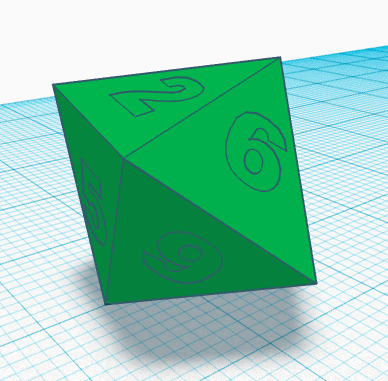
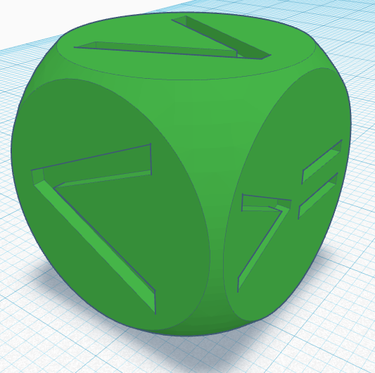

# Dados programación

Dados para introducir el pensamiento computacional en edades tempranas. Pueden usarse para trabajar los principios de los algoritmos y introducción al pseudo código o combinarlos con robot como Escornabot para que los chic@s declaren los movimientos que va a hacer el robot antes de ejecutarlos. 

Seguiremos la lógica de colores que usan programas como Scratch para que les resulten familiar las acciones que pueden realizar con cada dado: Azul para el movimiento, naranja para el control y condicionales, verde para lógica y matemáticas y azul claro para los sensores.

Todos los dados y complementos están diseñados en Tinkercad para que los alumnos puedan ver de forma fácil cómo están construidos y puedan modificarlos creando sus propios dados personalizados. 

[Enlace a Tinkercad](https://www.tinkercad.com/things/4HDoMNVHfnd-dados-programacion/)

Escornabot es robot libre que puedes construir tu mismo. Puedes encontrar más información en su [web](http://www.escornabot.com)

## Dado de Movimiento (Color Azul)

Con este dado podremos realizar movimientos básicos y giros. En sus caras podemos encontrar las siguientes acciones: Adelante, Atrás, Derecha, Izquierda, Ir y el logo de Escornabot.

## Dado de Control y Condicionales

Gracias a este dado realizaremos condicionales, repeticiones o esperas. Sus caras contienen: Si, Si no, Esperar, Siempre, Repetir y la palabra Maker ;)

## Dados de Lógica y Matemáticas

Por ahora tenemos 2 dados en esta sección, un dado de 10 caras para poder crear números y usarlo para crear pequeñas funciones junto al dado de lógica o complementando a las repeticiones para saber cuantas queremos realizar por ejemplo. Puedes usar un dado de 10 caras o imprimir alguno que encontrarás en [Thingiverse](http://www.thingiverse.com) por ejemplo.

En el otro dado encontramos los comparadores lógicos mayor que, menor que, mayor o igual que, menor o igual que, igual y distinto

## Dado de Sensores

Podemos encontrar distintos valores que podemos tomar con sensores básicos. En sus caras podemos encontrar Distancia, Temp (Temperatura), Luz, Sonido, Tocando y Color. Podemos usarlos en combinación con el resto de dados para crear instrucciones del tipo: Si distancia es menor que 4 (cm) ve para atrás y gira a la izquierda

